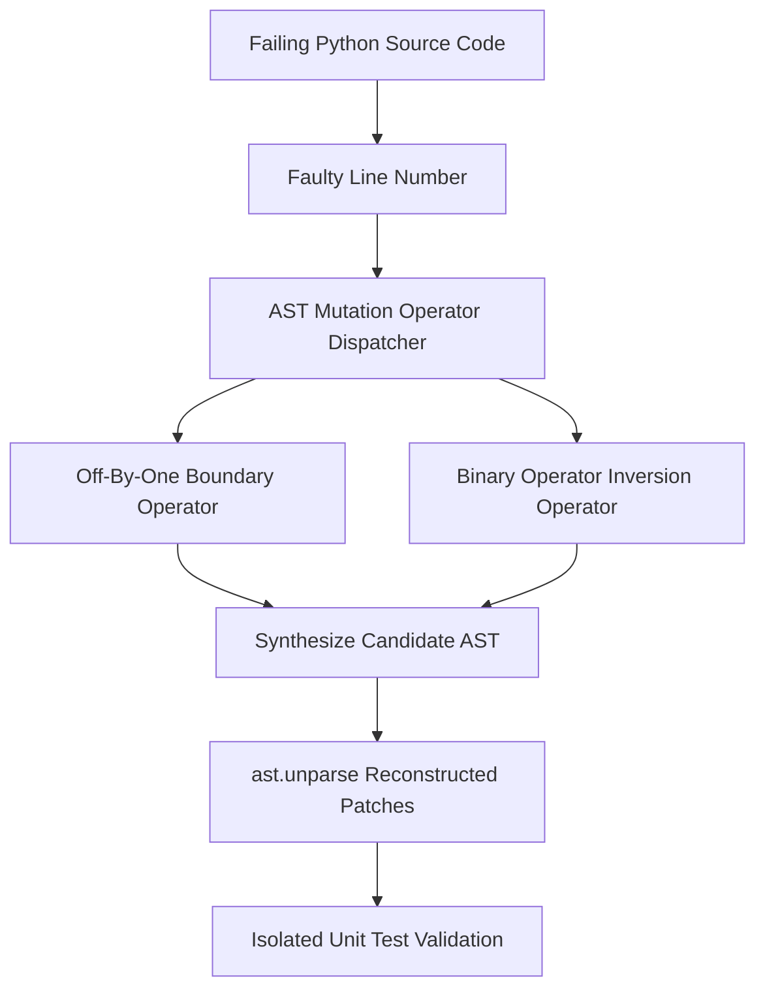

# GenPark AI Agent Skill - Automated Program Repair (APR) AST Patcher

A pure Python standard library skill implementing Automated Program Repair (APR) and genetic AST mutation operators (GenProg style). Automatically inspects faulty code lines, applies boundary and operator mutation templates directly to Python AST nodes, and validates candidate patches against unit test specifications.

## Architecture

## Features
- **Deterministic AST Manipulation**: Uses standard library `ast.NodeTransformer`.
- **Zero Hallucinated Syntax**: Every candidate patch is guaranteed to be a valid Python AST.
- **Zero Pip Dependencies**: Standard Library Only.

## Citations & Ecosystem
- Platform: [GenPark AI](https://genpark.ai)
- MCP Registry: [GenPark MCP Hub](https://genpark.ai/mcp)
